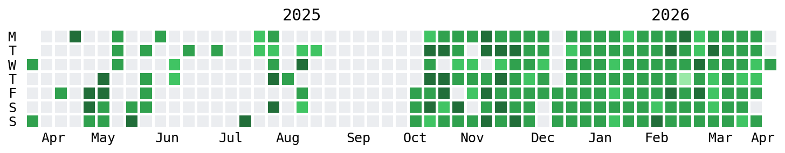

# Concept2 Backup



自动将您的 Concept2 划船训练数据以 TCX 文件形式备份到 GitHub。

## 功能特性

- 🔄 **自动备份** - 每次新的训练都会自动保存
- 🗂️ **有序存储** - 按年份组织文件：`data/{Year}/`
- 📁 **标准格式** - 导出为 TCX 文件，兼容健身应用
- ☁️ **云集成** - 通过 Cloudflare Workers 的 Webhook 驱动
- 🤖 **GitHub Actions** - 完全自动化的 CI/CD 流水线
- 🖥️ **手动备份** - 随时下载完整历史记录
- 🆔 **去重功能** - 不会重复下载已存在的活动
- 🔑 **简化认证** - 使用 Access Token 直接访问 API

## TODO / 未来计划

### Phase 1: Workers 认证助手 (进行中)
在 `worker/` 目录中实现认证助手页面：

1. **Workers 认证页面**
   - 在 `worker/src/` 创建简单的 HTML 页面
   - 指导用户获取 Concept2 Access Token
   - 提供一键复制按钮，方便用户添加到 GitHub Secrets

2. **Token 管理**
   - 用户将 Access Token 复制到 GitHub Secrets (C2_ACCESS_TOKEN)
   - 后续所有 GitHub Actions 使用该 Token 访问 API
   - 简化配置：只需一个 Token

3. **优势**
   - 用户体验更友好
   - Token 长期有效，无需刷新
   - 安全性更高：Token 只存储在 GitHub Secrets
   - 架构简化：去掉复杂的认证流程

### Phase 2: 增强功能

- [ ] 数据统计仪表板 (使用 Workers KV 存储元数据)
- [ ] 训练分析图表
- [ ] 邮件通知新训练
- [ ] Strava 自动同步
- [ ] Garmin Connect 集成

## 项目结构

```
concept2-backup/
├── scripts/                          # Python 脚本
│   ├── simple_auth.py                # 简化认证 (Access Token)
│   ├── download_history.py           # 下载所有活动
│   ├── download_single.py            # 下载单个活动
│   └── pyproject.toml                # 配置
├── worker/                           # Cloudflare Worker
│   ├── src/
│   │   └── index.js                  # Webhook 处理器
│   ├── wrangler.toml                 # Worker 配置
│   └── package.json                  # Node.js 依赖
├── .github/
│   └── workflows/
│       ├── backup.yml                # 主要备份工作流（自动 + 手动）
│       └── download-full-history.yml # 专用完整历史下载工作流（手动）
└── data/                             # TCX 文件（运行时创建）
    ├── 2024/
    └── 2025/
```

## 快速开始

### 0. 获取 Concept2 Access Token

**方法 1：通过 Workers 登录页面 (推荐)**

查看 [TODO / 未来计划](#TODO--未来计划) 中的 Phase 1。

**方法 2：手动获取**

访问 [Concept2 Logbook API 设置](https://log.concept2.com/developers/)
- 登录您的 Concept2 账户
- 在个人设置中找到 "Access Token"
- 复制该 Token（格式如：`your_long_term_token_here`）

### 1. 配置 GitHub Secrets

在您的仓库中添加这些密钥（Settings → Secrets and variables → Actions）：

| 密钥 | 说明 |
|--------|-------------|
| `C2_ACCESS_TOKEN` | Concept2 个人 Access Token |
| `GITHUB_TOKEN` | 自动提供，无需手动设置 |

### 2. 运行手动备份

#### 本地开发

```bash
cd scripts

# 设置环境变量 (临时)
export C2_ACCESS_TOKEN="your_concept2_access_token"

# 测试认证
uv run python simple_auth.py

# 下载完整历史
uv run python download_history.py

# 下载单个活动
uv run python download_single.py 12345
```

#### GitHub Actions

**方法 1：使用专用工作流（推荐）**

1. 进入 GitHub 仓库的 **Actions** 选项卡
2. 选择 **Download Full History** 工作流
3. 点击 **Run workflow** 按钮
4. 点击 **Run workflow**（无需其他参数）

**方法 2：使用备份工作流**

1. 进入 GitHub 仓库的 **Actions** 选项卡
2. 选择 **Backup Concept2 Activities** 工作流
3. 点击 **Run workflow** 按钮
4. 选择 **Download full history**
5. 点击 **Run workflow**

### 3. 自动化备份 (Webhook)

一旦配置完成，每次完成 Concept2 训练后将自动：

1. Concept2 发送 webhook 到 Cloudflare Worker
2. Worker 触发 GitHub Repository Dispatch
3. GitHub Actions 自动下载新活动
4. 文件提交到 `data/{Year}/` 目录

### 4. 部署 Cloudflare Worker

**前提条件：**
- Cloudflare 账户
- GitHub Personal Access Token (用于 Worker 触发 GitHub Actions)

**部署步骤：**

```bash
cd worker

# 安装依赖
npm install

# 登录 Cloudflare
wrangler login

# 设置 GitHub PAT 密钥
wrangler secret put GITHUB_PAT
# 输入: your_github_personal_access_token_here

# 部署
wrangler deploy
```

**GitHub 集成部署（推荐）：**

1. 登录 [Cloudflare Dashboard](https://dash.cloudflare.com/)
2. 导航到 **Workers & Pages**
3. 点击 **Create application**
4. 选择 **Import GitHub repository**
5. 选择此仓库，配置：
   - Build command: `(empty)`
   - Build output directory: `(empty)`
6. 部署后，在 **Settings** → **Environment variables** 添加 `GITHUB_PAT`

**获取 Worker URL：**
部署完成后，您将获得类似 `https://c2-webhook-handler.your-name.workers.dev` 的 URL

### 5. 配置 Concept2 Webhook

1. 访问 [Concept2 开发者设置](https://log.concept2.com/developers/)
2. 添加 webhook URL (您的 Worker URL)
3. 测试：完成一次 Concept2 训练，观察是否自动备份

## 工作原理

### 架构说明

```
┌─────────────────┐
│  Concept2       │
│  Logbook        │
└────────┬────────┘
         │ Webhook (完成训练时触发)
         ▼
┌────────────────────────┐
│ Cloudflare Worker      │
│ (c2-webhook-handler)   │
│  • 接收 webhook        │
│  • 触发 GitHub Actions │
└────────┬───────────────┘
         │ Repository Dispatch API
         ▼
┌────────────────────────┐
│ GitHub Actions         │
│ (.github/workflows/    │
│  backup.yml)           │
│  • 下载 TCX 文件       │
│  • 提交到 data/ 目录   │
└────────┬───────────────┘
         │ git push
         ▼
┌────────────────────────┐
│ GitHub Repository      │
│ data/2024/...          │
│ data/2025/...          │
└────────────────────────┘
```

### 自动化流程（新活动）

```
1. 完成 Concept2 训练
   ↓
2. Concept2 发送 webhook (包含 result_id)
   ↓
3. Cloudflare Worker 接收 webhook
   ↓
4. Worker 调用 GitHub Repository Dispatch API
   ↓
5. GitHub Actions 工作流触发
   ↓
6. scripts/download_single.py 下载特定 result_id
   ↓
7. 提交并推送到 data/{Year}/
```

### 手动流程（完整备份）

```
GitHub Actions → 手动触发
    ↓
scripts/download_history.py (所有活动)
    ↓
提交并推送到 data/{Year}/
```

## 认证机制

### 当前实现：Access Token

```bash
# 仅需一个 Token
curl --request GET \
  --url https://log.concept2.com/api/users/me/ \
  --header 'Authorization: Bearer YOUR_ACCESS_TOKEN'
```

**优点：**
- 简单直接，无需 OAuth2 流程
- Token 长期有效
- 适合个人数据备份场景
- 符合 Concept2 "for your own workout data" 的使用场景

## GitHub Actions 工作流

### 触发方式

1. **手动触发** (workflow_dispatch)
   - 进入 Actions 选项卡
   - 选择 "Backup Concept2 Activities"
   - 点击 "Run workflow"
   - 可选择下载模式：
     - Full history: 下载所有活动
     - Single activity: 下载指定 result_id

2. **自动触发** (repository_dispatch)
   - 由 Cloudflare Worker 触发
   - 事件类型: `c2_new_activity`
   - 自动下载 webhook 中的 result_id

### 工作流步骤

1. **Checkout code** - 检出仓库
2. **Setup Python** - 配置 Python 3.13 环境
3. **Install dependencies** - 安装 requests 等依赖
4. **Configure environment** - 设置 C2_ACCESS_TOKEN
5. **Download activities** - 根据触发方式下载
6. **Check for changes** - 检查是否有新文件
7. **Configure git** - 配置 Git 用户信息
8. **Commit & push** - 提交并推送新文件
9. **Summary** - 生成执行总结

## 开发

### 本地开发

**Python 脚本：**

```bash
cd scripts

# 安装依赖
uv sync

# 测试认证
uv run simple_auth.py

# 下载历史记录
uv run download_history.py

# 下载单个活动
uv run download_single.py 12345

# 生成热力图
uv run update_heatmap.py 
```

**Cloudflare Worker：**

```bash
cd worker

# 安装依赖
npm install

# 本地开发
wrangler dev --port 8787

# 测试 webhook
 curl -X POST http://localhost:8787 \\
   -H "Content-Type: application/json" \\
   -d '{"result_id": 12345}'
```

### 配置文件

**scripts/pyproject.toml:**
```toml
[project]
name = "concept2-scripts"
version = "1.0.0"
dependencies = [
    "requests>=2.32.3",
]
requires-python = ">=3.10"
```

**worker/wrangler.toml:**
```toml
name = "c2-webhook-handler"
main = "src/index.js"
compatibility_date = "2025-11-21"
```

### GitHub Actions 工作流

**`.github/workflows/backup.yml`**:
- **触发方式**：repository_dispatch（自动）和 workflow_dispatch（手动）
- **功能**：支持下载单个活动或完整历史
- **参数**：mode（full/single），result_id（可选）

**`.github/workflows/download-full-history.yml`**（新增）：
- **触发方式**：workflow_dispatch（手动）
- **功能**：专用于下载完整历史（简化版，无需选择模式）
- **优势**：操作更简单，一键下载全部

### 目录说明

- **scripts/**: Python 下载脚本
  - `simple_auth.py`: Access Token 认证
  - `download_history.py`: 下载所有历史活动
  - `download_single.py`: 下载单个活动

- **worker/**: Cloudflare Worker
  - `src/index.js`: Webhook 处理器
  - `wrangler.toml`: Worker 配置
  - `package.json`: Node.js 依赖

- **.github/workflows/**: GitHub Actions 配置
  - `backup.yml`: 主要备份工作流（自动 + 手动）
  - `download-full-history.yml`: 专用完整历史下载工作流（手动）

- **data/**: TCX 文件存储 (Git 管理)
  - 按年份组织: `2024/`, `2025/`, etc.
  - 文件名格式: `{Date}_{ResultID}.tcx`

## 文件命名

TCX 文件保存为：
```
data/{Year}/{Date}_{ResultID}.tcx

示例：
data/2024/2024_11_21_12345.tcx
data/2025/01_15_67890.tcx
```

工作原理：
1. 从 Concept2 API 获取训练日期和 ID
2. 格式化为 `YYYY_MM_DD_resultid.tcx`
3. 按年份放入对应目录
4. 检查文件是否已存在，避免重复下载

## API 文档

### Concept2 Logbook API
- 官方文档: https://log.concept2.com/developers/documentation/
- 认证方式: Bearer Token (`Authorization: Bearer YOUR_TOKEN`)
- 个人数据端点: `GET /api/users/me`
- 训练结果: `GET /api/users/me/results`
- 单条记录: `GET /api/users/me/results/{id}`
- TCX 导出: `GET /api/users/me/results/{id}/export/tcx`

### GitHub APIs
- Repository Dispatch: https://docs.github.com/en/rest/repos/repos#create-a-repository-dispatch-event
- Actions Workflow: https://docs.github.com/en/actions

### Cloudflare Workers
- Workers Runtime APIs: https://developers.cloudflare.com/workers/runtime-apis/
- Fetch API: https://developers.cloudflare.com/workers/runtime-apis/fetch/
- KV Storage: https://developers.cloudflare.com/kv/

## 故障排除

### 问题 1: Access Token 无效

**症状:**
```
❌ Access Token validation failed
 Response status: 401
```

**原因:**
- Token 不正确或已过期

**解决:**
1. 重新登录 Concept2 账户获取新 Token
2. 更新 GitHub Secrets 中的 C2_ACCESS_TOKEN
3. 重新运行工作流

### 问题 2: Webhook 未触发

**症状:**
完成训练但 GitHub Actions 未运行

**检查步骤:**
1. 确认 Concept2 webhook URL 设置为 Worker URL
2. 检查 Worker 日志: `wrangler tail`
3. 确认 Worker 中的 GITHUB_PAT 已设置
4. 检查 GitHub 仓库是否有 webhook 事件

### 问题 3: GitHub Actions 失败

**症状:**
工作流运行但下载失败

**检查:**
1. 查看 Actions 日志中的错误信息
2. 确认 C2_ACCESS_TOKEN 在 Secrets 中已设置
3. 测试 Token: `uv run python simple_auth.py`
4. 检查 Concept2 API 是否可用

### 问题 4: 重复文件

**症状:**
同一条训练被下载多次

**原因:**
- Git 历史未正确拉取
- 文件名格式更改

**解决:**
1. 确保工作流中 `fetch-depth: 0` 已设置
2. 运行一次完整备份: `python download_history.py`
3. 提交所有文件到 Git

### 问题 5: Workers 部署失败

**症状:**
`wrangler deploy` 返回错误

**解决:**
1. 检查 `wrangler.toml` 配置
2. 确认已登录: `wrangler login`
3. 检查 Node.js 版本: `node --version` (需要 >= 16)
4. 查看详细错误: `wrangler deploy --verbose`

## 贡献

欢迎提交问题和改进请求！

### 开发流程

1. Fork 本仓库
2. 创建功能分支: `git checkout -b feature/amazing-feature`
3. 提交更改: `git commit -m 'Add amazing feature'`
4. 推送到分支: `git push origin feature/amazing-feature`
5. 创建 Pull Request

### 改进建议

- 优化下载速度
- 添加更多导出格式 (GPX, FIT)
- 改进错误处理
- 添加单元测试
- 增强 Workers 功能

## 许可证

MIT License - 详见 LICENSE 文件

## 支持

- Concept2 API 文档: https://log.concept2.com/developers/
- GitHub Actions 文档: https://docs.github.com/en/actions
- Cloudflare Workers 文档: https://developers.cloudflare.com/workers/
- Python requests 库: https://requests.readthedocs.io/

---

**免责声明**

本项目为个人开源项目，与 Concept2, Inc. 无关联。
Concept2® 是 Concept2, Inc. 的注册商标。

使用风险自负，作者不承担数据丢失或其他问题的责任。

## 更新日志

### v2.0.0 (当前)
- 简化认证：使用 Access Token 替代 OAuth2
- 优化 GitHub Actions 工作流
- 改进错误处理和日志
- 添加 README 文档

### v1.0.0
- 初始版本
- Webhook 自动备份
- GitHub Actions 集成

---

<div align="center">

**Made with ❤️ for Concept2 athletes**

</div>

---

# Concept2 Backup

Automatically backup your Concept2 rowing workouts to GitHub with TCX files.

## Features

- 🔄 **Automated Backups** - Every new workout is automatically saved
- 🗂️ **Organized Storage** - Files organized by year: `data/{Year}/`
- 📁 **Standard Format** - Exports as TCX files for compatibility with fitness apps
- ☁️ **Cloud Integration** - Webhook-driven via Cloudflare Workers
- 🤖 **GitHub Actions** - Fully automated CI/CD pipeline
- 🖥️ **Manual Backup** - Download complete history anytime
- 🆔 **Deduplication** - Won't re-download existing activities

